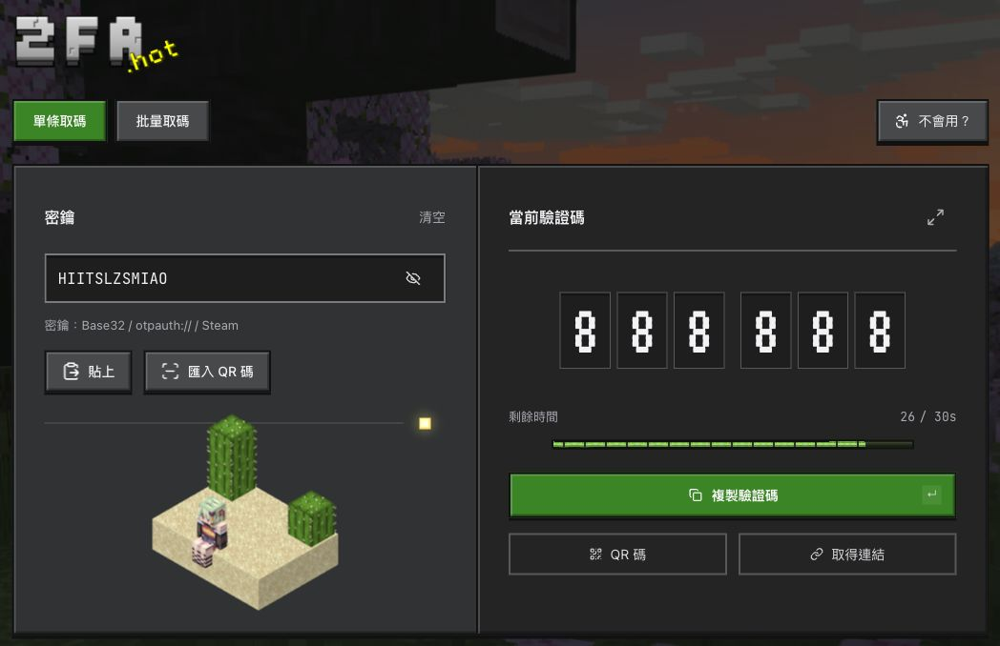

<div align="center">

<h1>2FA.HOT</h1>

[English](docs/readme/README.en.md) · [简体中文](docs/readme/README.zh-CN.md) · **繁體中文**


</div>

<!-- website:intro:start -->

多功能線上 2FA 工具， 貼上密鑰，取得目前驗證碼。以 Minecraft 風格為參考設計。支援直鏈、取碼完全由本地處理。

支援自動識別/切換批量數據，同時支援多種密鑰格式 - 無論是從 Excel表單複製過來的傻逼格式、或因您的客戶不會使用、連帶密碼+密鑰一起複製過來，都能識別並有相應提示。
無障礙指南。可選用語音 一對一教學如何使用密鑰登入帳戶！
正在集成更多功能…

<!-- website:intro:end -->

<br>

[](https://2fa.hot)

[開始使用](https://2fa.hot/zh-TW) · [使用說明](https://2fa.hot/zh-TW/help) · [安全漏洞回報](.github/SECURITY.md)

<!-- website:body:start -->

## 具體能做什麼

- 單條／批次取碼：支援 Base32 密鑰、otpauth:// 設定連結。
- 掃碼匯入：圖片、拖放、相機；支援 Google Authenticator 匯出 QR 碼、多帳號和分張匯出，收齊後選擇需要的帳號。
- 連結直達：支援片段直鏈，直接顯示目前驗證碼，可一鍵複製或批量生成連結。
- 本機紀錄：預設不儲存，可主動開啟；支援可選加密、備份與還原。
- 30 種語言：適配手機、深淺主題；不會用就點教學，跟著鑽石劍走一遍。

支援 TOTP（SHA-1／SHA-256／SHA-512、6／8 位）與 Steam Guard（5 位、30 秒）。Steam 可輸入 shared_secret 或貼上 maFile JSON 內容。HOTP 不參與取碼；遷移檔案中的 HOTP／MD5 帳號可解析匯出。

## 怎麼用

- 複製 2FA 密鑰，在 2fa.hot 貼上密鑰或匯入 QR 碼。
- 在倒數計時內複製使用目前驗證碼。

## 密鑰存取

- 首頁取碼和 QR 碼辨識完全在瀏覽器內完成。
- 主動開啟本機紀錄後，紀錄會儲存在你的瀏覽器中。還可以設定密碼加密保護，也可以不設密碼，直接查看。
- 新直達連結使用 `/2fa#密鑰`，密鑰和驗證參數位於 `#` 後面，僅由瀏覽器本地讀取，不會隨頁面請求傳至託管服務。舊 `/2fa/密鑰` 連結仍會隨請求傳送密鑰，建議改用新格式。完整連結仍含密鑰，也可能留在瀏覽器歷史裡。

最後，請勿公開分享或交給不信任的人。忘記本機紀錄口令後，網站無法幫你找回。

[隱私說明](https://2fa.hot/privacy)

## 域名相關

原本想註冊2fa.mc 但由於無法註冊 **2FA®** 以提交摩納哥管局認證作罷。
...假如我寫這段話的時候繃住了呢。
於是.HOT 來了。好吧，好吧，我承認這是性感的，我們所以回去。

## 為什麼做這個？重複造輪子？

由於好友做跨境電商，有例如媒體賬戶運營的登錄需求，還需考慮安全性。想到能為更多此類朋友們，乃至於剛接觸互聯網的朋友提供幫助，便以此為出發點。
網路上有很多類似的在線工具，還能以直鏈取得代碼。但如果你不知道的話，只要訪問直接帶密鑰的網址，例如 `/2fa/密鑰` 或 `?secret=密鑰`，瀏覽器會把密鑰隨 HTTP 請求傳送出去，對方的遠端網站服務或 CDN 能收到這份資料，也能透過存取日誌、監控或應用程式記錄並留存。也就是說，這些請求中的密鑰可能被明文儲存；假如你曾經還貼入過賬戶+密碼+2FA，而對方也上傳並留存這些內容... BOOM! 當然，是否實際留存取決於對方的實作、設定與隱私政策:))

<details>
<summary>故事</summary>

...大概是2021年，第四次工業革命，人類進入AI時代。由此，經常看到有人在濫用，甚至專業程序員，也幹這種勾當——只用5分鐘 就生成一個他媽的漸變、不對齊、用了100個不同設計風格UI、1000種元素的前端。
像是某些連我訊息都不敢回的人，只用AI隨便做一個粗製濫造的垃圾系統 就能賣貨給灰產用戶發大財。
…這一切看得我噁心，我從床上爬起來，吐了一遍又一遍，可惜沒被穩穩接住。

我想要做的 有錢人都做過了。2fa.hot 幾乎由 Vibe Coding 完成——當然，我將它改到勉強滿意才上線。正如我和同事的某些項目一樣，我們希望早日上線，但止不住一遍遍修訂，直到符合我們的要求，直到它從未上線。某些項目也許未來會被讀這條文字的各位熟知，儘管你們也不會知道那是我們做的。這感覺 像是回到6年前，打開Premiere Pro，全身心投入創作，樂此不疲。可如今我卻再做不出影片了，令人感嘆。
我想要說的 前人們都說過了。我不反對AI。6年前 我是文科生，我可能連他媽怎麼開個網站都不知道。我希望 某些人能善用AI。它能幫你做事，但不能成為你，永遠。請別用它代替你的想法，代替你的人生；別用它寫出個自己都懶得玩的設計、各種影響體驗的BUG邏輯… 快用localhost打開，繼續打磨100遍。否則，那不是你自己的，別放出來惡心任何人。賣錢？你不配，只能一直在灰色產業摸爬滾打。
我想要的公平都是不公們虛構的。我知道 我改變不了當今快節奏的生活，也攔不住的那些。它們。

</details>

<!-- website:body:end -->

## 素材來源與致謝

- Minecraft 背景、音效與貼圖：Mojang / Microsoft。[背景](credits/PANORAMA-SOURCE.md) · [音效](credits/AUDIO-SOURCE.md) · [經驗條](credits/HUD-SOURCE.md) · [箱子](credits/CHEST-SOURCE.md) · [試煉鑰匙](credits/TRIAL-KEY-SOURCE.md) · [沙漠場景](credits/DESERT-SOURCE.md)。
- 叢雨角色皮膚：[Konata / LittleSkin，作品 513373](https://littleskin.cn/skinlib/show/513373)。角色姿勢與場景編排由本專案製作，皮膚權利歸原作者所有。
- 介面設計參考：[OreUI](https://katorly.dev/OreUI/zh-CN/)。
- 字體：VT323 Project Authors、Inter Project Authors、JetBrains Mono Project Authors，採用 SIL Open Font License 1.1。[VT323 授權](credits/VT323-OFL.txt) · [Inter 授權](credits/Inter-OFL.txt) · [JetBrains Mono 授權](credits/JetBrains-Mono-OFL.txt)。
- 介面圖示：[Lucide Contributors](https://github.com/lucide-icons/lucide)，[ISC 授權](https://github.com/lucide-icons/lucide/blob/main/LICENSE)。

本專案與 Mojang / Microsoft 無隸屬或官方合作關係。第三方素材的權利及授權仍歸各自權利人；列出來源不表示取得額外授權。預覽圖包含上述第三方素材。

## 授權與公開部署

本版本的專案自有程式碼及文件採用 [AGPL-3.0](LICENSE)，並附有 [NOTICE](NOTICE) 的合理來源署名要求。公開部署衍生網站、修改版為用戶提供服務時，須向使用者提供該版本的對應原始碼。第三方素材依各自條款使用。

```sh
pnpm install
pnpm dev
# Production build
pnpm build
```
