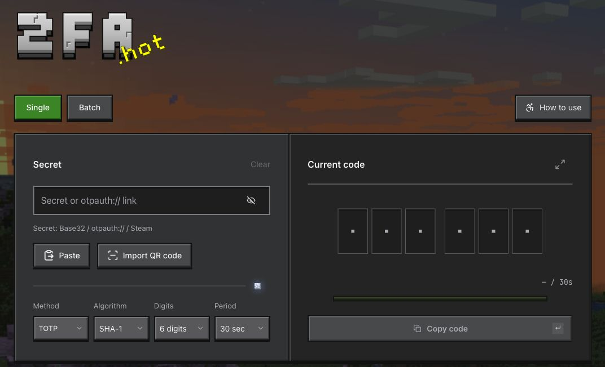

# 2FA.HOT

<!-- website:intro:start -->

A multifunctional online 2FA tool inspired by Minecraft. Paste an existing secret to get the current verification code. Supports fragment links, with code generation handled locally.

More features are being integrated…

It automatically detects and switches to batch data, and recognizes multiple secret formats—whether it is some fucked-up format copied from Excel, or your customers not knowing what they are doing and copying their password along with the secret, it recognizes the input and gives the appropriate prompts.

Introducing:

An accessible guide. Optional voice narration teaches you one-on-one how to use a secret to log into an account!

<!-- website:intro:end -->

[繁體中文](../../README.md) · [简体中文](README.zh-CN.md) · [English](README.en.md) · [Start](https://2fa.hot) · [Help](https://2fa.hot/help) · [Issues](https://github.com/LZSMIAO/2fa-hot/issues)


[](https://2fa.hot)

<!-- website:body:start -->

## What exactly can it do

- Single and batch codes: supports Base32 secrets and otpauth:// configuration links.
- QR import: images, drag and drop, or camera; supports Google Authenticator exports, multiple accounts and multi-part exports. Collect all parts, then select the accounts you need.
- Direct links: open [https://2fa.hot/2fa#YOUR_SECRET](https://2fa.hot/2fa#YOUR_SECRET) to see the current code. The secret stays after `#`, read and processed locally in your browser without being sent to the remote service in the HTTP page request.
- Local history: off by default, with opt-in storage; enable or remove password protection whenever you want, with backup and restore.
- 30 languages: mobile layouts and light/dark themes. Need help? Follow the diamond sword through the tutorial.

Supports TOTP, SHA-1/SHA-256/SHA-512 and 6/8-digit codes. HOTP and Steam-specific formats do not generate codes here; HOTP/MD5 accounts in migration files can be parsed and exported.

Google Authenticator import: choose “Transfer accounts → Export accounts” in Google Authenticator, then scan/upload through “Import QR code → Google Authenticator” here to export your secrets elsewhere.

…And More

## How to use it

1. Copy your 2FA secret and paste it into 2fa.hot, or import a QR code.
2. Copy the current code before the countdown ends and enter it in the website or app requesting verification. If it is about to expire, wait for the next one.
3. Generate direct links processed locally, with one-click copying or batch generation.

## Where the secret keys go

Homepage code generation and QR recognition happen entirely in your browser.

When you enable local history, records are stored in your browser. Code generation, QR recognition and history storage all happen locally. You can set a password for encryption, or leave it unset and view records directly.

New direct links use `/2fa#SECRET`. The secret and verification parameters after `#` are read locally by your browser and are not sent to the hosting service with the page request. Legacy `/2fa/SECRET` links still work, but their path sends the secret to the hosting service. The project's deployment settings disable Workers logs and Logpush; this does not change how legacy links transmit secrets. Full links still contain secrets and may remain in browser history, so we do not recommend legacy path-based links.

Finally, do not share them publicly or with anyone you do not trust. Forgotten local-history passphrases cannot be recovered.

## Domain drama

I originally wanted 2fa.mc, but gave up because I couldn't register **2FA®** to submit to Monaco's domain registry.

...What if I kept a straight face while writing this? Then .HOT came along. Fine, fine, I'll admit it: that's sexy. We're going back.

## Why I made this? Reinventing the wheel?

I've used plenty of similar online tools that generate codes through direct links. If you didn't know, opening a URL containing a secret, such as `/2fa/SECRET` or `?secret=SECRET`, sends the secret in an HTTP request. The remote website service or CDN receives that data and can record and retain it through access logs, monitoring or application logging. In other words, secrets in those requests may be stored in plain text; if you also pasted an account + password + 2FA, and the site uploaded and retained those too... BOOM! Of course, whether it actually retains them depends on its implementation, settings and privacy policy :))

...Around 2021, the Fourth Industrial Revolution, humanity entered the AI era. Since then, I keep seeing people abusing it—even professional programmers pulling this shit—taking just 5 minutes to generate a fucking gradient, misaligned frontend with 100 different UI design styles and 1,000 elements.

Like certain people who won't even dare reply to my messages, using AI to throw together a shoddy garbage system and making a fortune selling it to gray-market users.

…All of this makes me sick. I crawled out of bed and threw up again and again. Unfortunately, I wasn’t caught steadily.

Everything I want to do, rich people have already done. Almost all of 2fa.hot was made through Vibe Coding—of course, I revised it until I was barely satisfied before launching. Like some projects my colleagues and I work on, we want to launch soon, but can't stop revising them until they meet our standards, until they have never gone live. Some projects might one day become familiar to those of you reading this, although you won't know we made them. It feels like going back six years, opening Premiere Pro, throwing myself into creating and never getting tired of it. Yet now I can't make videos anymore. It makes you think.

Everything I want to say has been said before. I'm not against AI. Six years ago, I studied the humanities; I might not even have known how the fuck to put a website online. I hope certain people can use AI well. It can help you do things, but it can never become you. Ever. Please don't let it replace your thoughts or your life; don't use it to produce a design you can't even be bothered to play with yourself, full of bugs and logic that ruin the experience… Open it on localhost and polish it another 100 times. Otherwise, it isn't yours. Don't release it and disgust everyone. Sell it? You don't deserve to. You'll just keep scrambling around in gray-market industries.

The fairness I want is all a fiction invented by the unfair. I know I can't change today's fast-paced life, or stop those things. Them.

[Privacy](https://2fa.hot/privacy)

<!-- website:body:end -->

## Sources and credits

- Minecraft backgrounds, sounds and textures: Mojang / Microsoft. [Panorama](../../credits/PANORAMA-SOURCE.md) · [Audio](../../credits/AUDIO-SOURCE.md) · [Experience bar](../../credits/HUD-SOURCE.md) · [Chest](../../credits/CHEST-SOURCE.md) · [Trial key](../../credits/TRIAL-KEY-SOURCE.md) · [Desert scene](../../credits/DESERT-SOURCE.md).
- Congyu character skin: [Konata on LittleSkin, entry 513373](https://littleskin.cn/skinlib/show/513373). The pose and scene composition are project-created; skin rights remain with the creator.
- Interface design reference: [OreUI](https://katorly.dev/OreUI/zh-CN/).
- Fonts: VT323 Project Authors, Inter Project Authors and JetBrains Mono Project Authors, under SIL Open Font License 1.1. [VT323 license](../../credits/VT323-OFL.txt) · [Inter license](../../credits/Inter-OFL.txt) · [JetBrains Mono license](../../credits/JetBrains-Mono-OFL.txt).
- Interface icons: [Lucide Contributors](https://github.com/lucide-icons/lucide), under the [ISC license](https://github.com/lucide-icons/lucide/blob/main/LICENSE).

This project is not affiliated with or officially partnered with Mojang / Microsoft. Third-party assets retain their respective ownership and licenses; attribution does not grant additional permission. Preview images contain the third-party assets listed above.

## License and public deployments

Project-owned code and documentation in this release use [AGPL-3.0](../../LICENSE) with the reasonable attribution notice in [NOTICE](../../NOTICE). Public derivative deployments must retain accessible 2fa.hot attribution. Modified network versions must offer users their Corresponding Source. Personal/local-only use is exempt from on-screen attribution, but source notices remain. Third-party assets retain their own terms. Earlier MIT releases are not retroactively relicensed.

```sh
pnpm install
pnpm dev
# Production build
pnpm build
```
