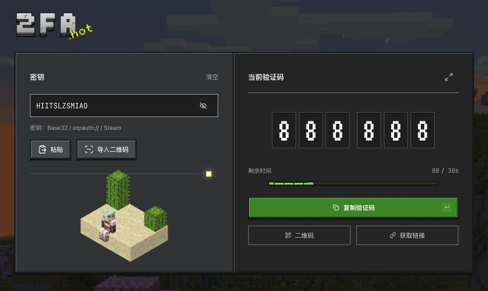

<div align="center">

<h1>2FA.HOT</h1>

[English](README.en.md) · **简体中文** · [繁體中文](../../README.md)


</div>

<!-- website:intro:start -->

多功能线上 2FA 工具， 以 Minecraft 风格为设计参考。贴上 2FA 密钥，取得目前验证码。支持直链，取码全由本地处理。

它不仅支持自动识别/切换批量数据，同时支持多种密钥格式 - 无论是从 Excel表单复制过来的傻逼格式、或因您的客户不会使用、连带密码+密钥一起复制过来，都能识别并有相应提示。
无障碍指南。可选用语音 一对一教学如何使用密钥登录账户！
正在集成更多功能…

<!-- website:intro:end -->

<br>

[](https://2fa.hot)

[开始使用](https://2fa.hot/zh-CN) · [使用说明](https://2fa.hot/zh-CN/help) · [安全漏洞报告](../../.github/SECURITY.md)

<!-- website:body:start -->

## 具体能做什么

- [Lite 轻量版](https://2fa.hot/lite?lang=zh-CN)：无动画、音效或主站框架，提供单条取码、复制与片段直链；支持繁中、简中和英文，以 IE11 为兼容目标。
- 单条／批次取码：支持 Base32 密钥、otpauth:// 设置链接。
- 扫码导入：图片、拖放、相机；支持 Google Authenticator 导出 QR 码、多账号和分张导出，收齐后选择需要的账号。
- 链接直达：支持片段直链，直接显示目前验证码，可一键复制或批量生成链接。
- 本地记录：默认不存储，可主动开启；支持可选加密、备份与还原。
- 30 种语言：适配手机、深浅主题；不会用就点教学，跟着钻石剑走一遍。

支持 TOTP（SHA-1／SHA-256／SHA-512、6／8 位）和 Steam Guard（5 位、30 秒）。Steam 可输入 shared_secret 或粘贴 maFile JSON 内容。HOTP 不参与取码；迁移文件中的 HOTP／MD5 账号可解析导出。

## 怎么用

- 复制 2FA 密钥，在 2fa.hot 贴上密钥或导入 QR 码。
- 在倒计时内复制使用目前验证码。

## 密钥存取

- 首页取码和 QR 码识别完全在浏览器内完成。
- 主动开启本地记录后，记录会存储在你的浏览器中。还可以设置密码加密保护，也可以不设密码，直接查看。
- 新直达链接使用 `/2fa#密钥`，密钥和验证参数位于 `#` 后面，仅由浏览器本地读取，不会随页面请求传至托管服务。旧 `/2fa/密钥` 链接仍会随请求传送密钥，建议改用新格式。完整链接仍含密钥，也可能留在浏览器历史里。

最后，请勿公开分享或交给不信任的人。忘记本地记录口令后，网站无法帮你找回。

[隐私说明](https://2fa.hot/privacy)

## 域名相关

原本想注册2fa.mc 但由于无法注册 **2FA®** 以提交摩纳哥管局认证作罢。
...假如我写这段话的时候绷住了呢。
于是.HOT 来了。好吧，好吧，我承认这是性感的，我们所以回去。

## 为什么做这个？重复造轮子？

由于好友做跨境电商，有例如媒体账户运营的登录需求，还需考虑安全性。想到能为更多此类朋友们，乃至于刚接触互联网的朋友提供帮助，便以此为出发点。
网络上有很多类似的在线工具，还能以直链取得代码。但如果你不知道的话，只要访问直接带密钥的网址，例如 `/2fa/密钥` 或 `?secret=密钥`，浏览器会把密钥随 HTTP 请求传送出去，对方的远端网站服务或 CDN 能收到这份资料，也能透过存取日志、监控或应用程序记录并留存。也就是说，这些请求中的密钥可能被明文存储；假如你曾经还贴入过账户+密码+2FA，而对方也上传并留存这些内容... BOOM! 当然，是否实际留存取决于对方的实现、设置与隐私政策:))

<details>
<summary>故事</summary>

...大概是2021年，第四次工业革命，人类进入AI时代。由此，经常看到有人在滥用，甚至专业程序员，也干这种勾当——只用5分钟 就生成一个他妈的渐变、不对齐、用了100个不同设计风格UI、1000种元素的前端。
像是某些连我讯息都不敢回的人，只用AI随便做一个粗制滥造的垃圾系统 就能卖货给灰产用户发大财。
…这一切看得我恶心，我从床上爬起来，吐了一遍又一遍，可惜没被稳稳接住。

我想要做的 有钱人都做过了。2fa.hot 几乎由 Vibe Coding 完成——当然，我将它改到勉强满意才上线。正如我和同事的某些项目一样，我们希望早日上线，但止不住一遍遍修订，直到符合我们的要求，直到它从未上线。某些项目也许未来会被读这条文字的各位熟知，尽管你们也不会知道那是我们做的。这感觉 像是回到6年前，打开Premiere Pro，全身心投入创作，乐此不疲。可如今我却再做不出影片了，令人感叹。
我想要说的 前人们都说过了。我不反对AI。6年前 我是文科生，我可能连他妈怎么开个网站都不知道。我希望 某些人能善用AI。它能帮你做事，但不能成为你，永远。请别用它代替你的想法，代替你的人生；别用它写出个自己都懒得玩的设计、各种影响体验的BUG逻辑… 快用localhost打开，继续打磨100遍。否则，那不是你自己的，别放出来恶心任何人。卖钱？你不配，只能一直在灰色产业摸爬滚打。
我想要的公平都是不公们虚构的。我知道 我改变不了当今快节奏的生活，也拦不住的那些。它们。

</details>

<!-- website:body:end -->

## 素材来源与致谢

- Minecraft 背景、音效与贴图：Mojang / Microsoft。[背景](../../credits/PANORAMA-SOURCE.md) · [音效](../../credits/AUDIO-SOURCE.md) · [经验条](../../credits/HUD-SOURCE.md) · [箱子](../../credits/CHEST-SOURCE.md) · [试炼钥匙](../../credits/TRIAL-KEY-SOURCE.md) · [沙漠场景](../../credits/DESERT-SOURCE.md)。
- 丛雨角色皮肤：[Konata / LittleSkin，作品 513373](https://littleskin.cn/skinlib/show/513373)。角色姿势与场景编排由本项目制作，皮肤权利归原作者所有。
- 界面设计参考：[OreUI](https://katorly.dev/OreUI/zh-CN/)。
- 字体：VT323 Project Authors、Inter Project Authors、JetBrains Mono Project Authors，采用 SIL Open Font License 1.1。[VT323 授权](../../credits/VT323-OFL.txt) · [Inter 授权](../../credits/Inter-OFL.txt) · [JetBrains Mono 授权](../../credits/JetBrains-Mono-OFL.txt)。
- 界面图标：[Lucide Contributors](https://github.com/lucide-icons/lucide)，[ISC 授权](https://github.com/lucide-icons/lucide/blob/main/LICENSE)。

本项目与 Mojang / Microsoft 无隶属或官方合作关系。第三方素材的权利及授权仍归各自权利人；列出来源不表示取得额外授权。预览图包含上述第三方素材。

## 授权与公开部署

本版本的专案自有代码及文件采用 [AGPL-3.0](../../LICENSE)，并附有 [NOTICE](../../NOTICE) 的合理来源署名要求。公开部署衍生网站、修改版为用户提供服务时，须向使用者提供该版本的对应源代码。第三方素材依各自条款使用。

```sh
pnpm install
pnpm dev
# Production build
pnpm build
```
